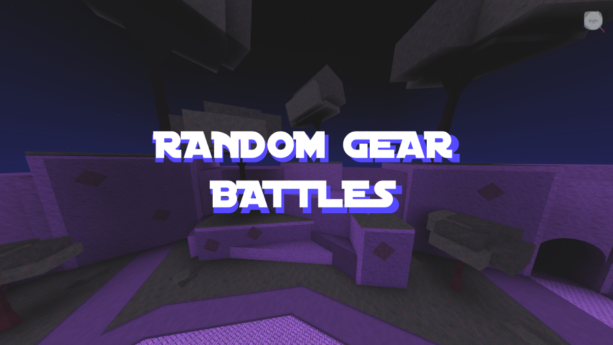

# Random Gear Battles

Multiplayer Roblox combat game where players battle using randomly assigned gear.

- 13,500+ players
- Built with Lua and Roblox Studio  
- Implemented multiplayer networking for 30-50 concurrent players
- Optimized server performance to reduce lag
- Developed 2018-2020 as self-taught project

[Play on Roblox]([link](https://www.roblox.com/games/136246051026468/Random-Gear-Battles))

## Technical Highlights
- Random gear distribution system
- Server-client architecture for multiplayer
- Performance optimization for scale
- Player stats persistence with DataStore
